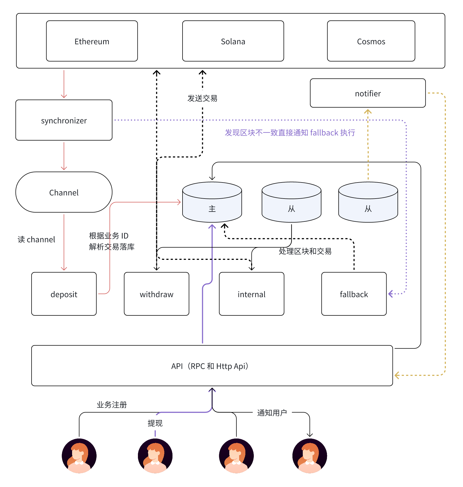

# dapp-multichain-sync-account
dapp-multichain-sync-account

# 账户模型扫链系统

## 1、钱包功能模块
- 充值 （解析块里面交易，判断属于哪类交易）
- 提现
- 归集 + 转冷
- 回滚

## 2、数据库表设计
- 业务注册表：business
- 扫块信息表：blocks
- 回滚信息表：reorg_blocks
- 交易流水表：transactions
- 账户信息表：address
- token配置表：token
- 账户余额表：balances
- 充值表：deposit
- 提现表：withdraw
- 内部交易表：internal (归集和转冷)

## 3、项目框架

